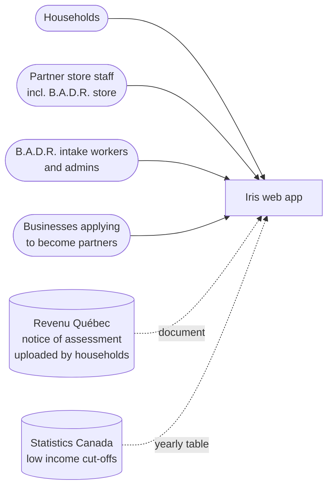
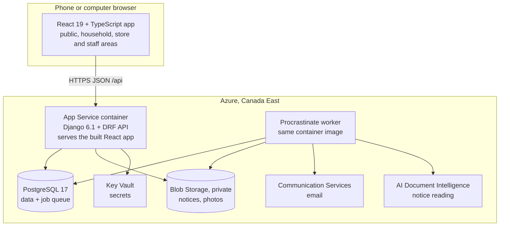

# Architecture

Iris is a **modular monolith**: one Django application and one React application, deployed as one container, split inside into modules with strict walls. Each module covers one area of the business, owns its tables, and is owned by one pair. Why this design, what it costs and the alternatives we rejected are in [ADR 0001](../adr/0001-tech-stack.md).

## Context



## Containers



## Modules (initial idea)

The plan is to organize the application into separate modules, each covering one area of the system. Each module would have its own Django app on the backend and a matching feature folder on the frontend, so related code stays together. The exact list and boundaries are expected to change as the project develops.

| Area | Possible modules | Rough purpose |
| --- | --- | --- |
| Accounts & partners | `accounts`, `stores` | Sign-in, user management, and partner businesses |
| Households | `households`, `documents`, `eligibility`, `priority` | Registering households and determining who qualifies |
| Goods | `listings`, `reservations`, `categories`, `needs` | Posting items and letting households claim them |
| Staff tools | `review`, `reporting` | Supporting staff in reviewing cases and seeing overall activity |
| Shared services | `rules`, `notifications`, `audit`, `privacy` | Common functionality used across the system |

**Dependencies (tentative)**

Modules should interact through a small, defined interface rather than reaching into each other's internals. Shared services like notifications and audit logging are expected to be usable by any module. Specific dependency rules will be worked out once the modules are better defined.

### Layers inside a module (initial idea)

Each backend module would follow a similar internal structure, separating business logic from data access and the API. A rough outline:

```
backend/modules/<module>/
├── domain/      core business logic, kept independent of the framework
├── services.py  actions that change data; used by other modules
├── queries.py   read-only functions other modules can use
├── models.py    database tables
├── api/         endpoints exposed to the frontend
└── tests/       tests for the module
```

The general goal is to keep business logic easy to test, keep the API layer thin, and have modules interact only through their services and queries. Details such as background jobs and documentation conventions will be decided as development progresses.

### External services (initial idea)

Third-party services like file storage, email, and document processing would be wrapped behind simple interfaces so they can be swapped out or replaced with fakes during local development and testing. Azure is the likely provider for production, with specific services to be confirmed.

| Service | Purpose |
| --- | --- |
| File storage | Storing uploaded documents |
| Email | Sending notifications to users |
| Document reading | Extracting information from uploaded documents (approach to be decided) |

## Front end (initial idea)

The frontend would be organized around the main types of users, with shared code kept separate:

```
frontend/src/
├── app/        routing and overall layout
├── areas/
│   ├── public/     pages available before signing in
│   ├── household/  pages for households
│   ├── store/      pages for partner stores
│   └── staff/      pages for staff
├── features/   code tied to specific modules
└── shared/     reusable components, styling, and translations
```

Screens and routes will be defined once requirements are formalized.

## Deployment

| Environment | Where | How it is updated |
| --- | --- | --- |
| Local | Docker Compose: backend, frontend, PostgreSQL, Azurite, Mailpit | `docker compose up` |
| Staging | Resource group `iris-staging`, Azure Canada East | Every merge to `main` after CI (deploy-staging.yml), migrations and seed |
| Production | Resource group `iris-production`, Azure Canada East | Tagged release with manual approval (release.yml); daily database backups kept 7 days |

Azure resources per environment: App Service (Linux container, B1), PostgreSQL Flexible Server (B1ms), Storage account (private Blob container `notices`, `photos`), Communication Services (email), Key Vault, Application Insights. Budget alert at 60 USD per month. Estimated cost: about 35 to 50 USD per month for production, covered by B.A.D.R.'s Microsoft nonprofit grant.
